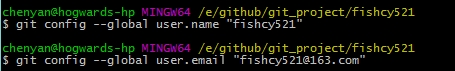
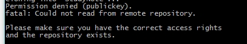
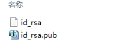
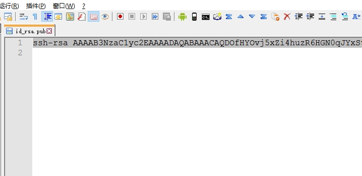
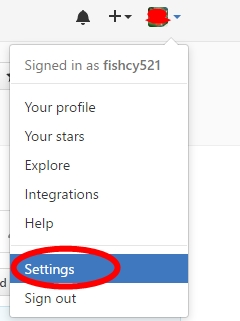
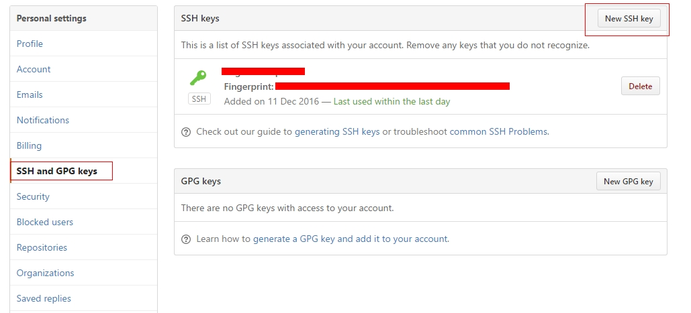
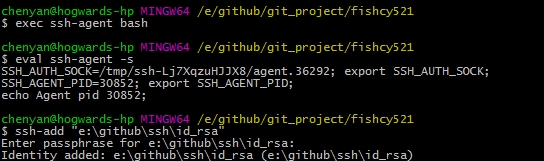
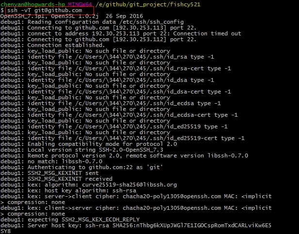
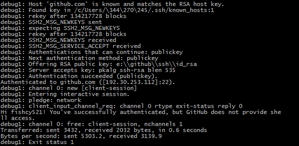

# Git SSH Key 生成步骤

1. 设置 全局的user.name和user.email

   

2. 这个时候如果执行 "git clone" 已知的repo  是不可以的，会提示以下错误

   

3. 提示这个错误，说明本地没有rsa先关的文件，windows系统默认是在 当前用户/.ssh/目录下，有连个文件，一个叫id_rsa和id_rsa.pub

   

4. 执行一下操作，则会生成id_rsa和id_rsa.pub两个文件

   

5. 执行出现如上图结果后，在路径下就会生成id_rsa和id_rsa.pub文件，使用文本工具，打开id_rsa.pub文件，复制里面的内容

   

6. 登录https://github.com,在右上角的头像点击，并选择setting

   

7. 选择SSH and GPG keys,然后点击New SSH key,在弹出框中按照图中描述填写即可

   

   

8. 以上步骤执行完之后,一次执行以下步骤

   

9. 最后执行以下测试命令，如果出现下图情况，则说明配置成功

   

   