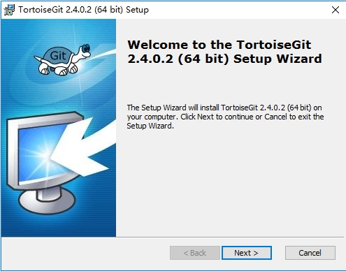
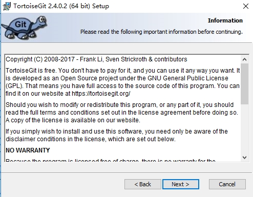
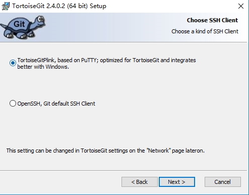
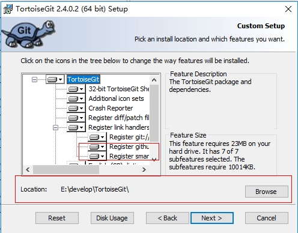
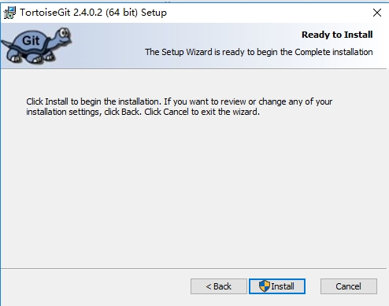
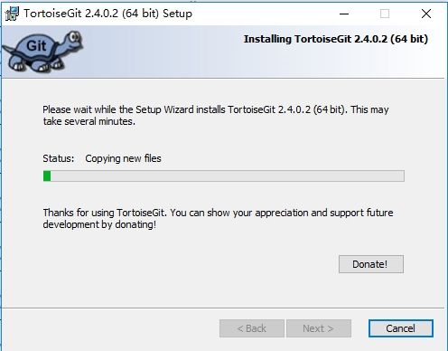
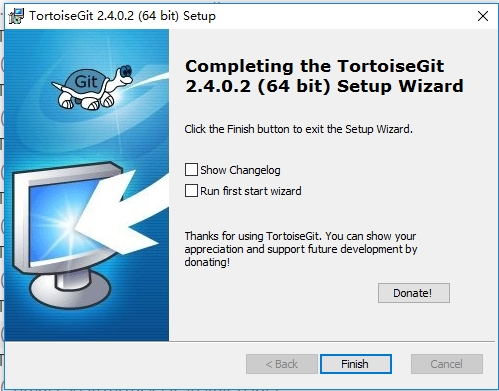
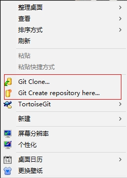

tortoisegit 安装
===========================================

1. 打开安装程序，进入安装界面
   
2. 点击"NEXT"
   
3. 点击"NEXT"
   
4. 点击"NEXT"
   
5. 点击"NEXT"
   
6. 安装中请稍后
   
7. 点击"Finish"，完成安装
   
8. 安装成功后，在空白处，单机鼠标右键，出现图中红色标记部分，表示完成安装，并生效
   
