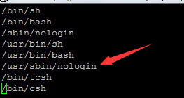

#linux 环境搭建


###目录
1. [Linux搭建ftp 虚拟用户](#Linux搭建ftp 虚拟用户)
2. [ 禁止ftp用户ssh登录，允许ftp登录](# 禁止ftp用户ssh登录，允许ftp登录)
3. [Linux的用户和用户组管理](#Linux的用户和用户组管理)


Linux搭建ftp 虚拟用户 
------------


禁止ftp用户ssh登录，允许ftp登录
--------------------------------------
1.执行如下命令，找到nologin的shell   
```linux
vi /etc/shells
```

2.可以看到禁止登录的shell文件为/usr/sbin/nologin，然后执行如下命令
```linux
usermod -s /usr/sbin/nologin username
```
执行完这个命令后就实现了ftp可登陆但是ssh不能登陆
3.如果要恢复ssh登陆执行
```linux
usermod -s /bin/bash username
```


Linux的用户和用户组管理
---------------
1.	添加新的用户账号使用useradd命令，语法如下：
	useradd 选项 用户名
	其中各选项含义如下：
	-c comment 指定一段注释性描述。
	-d 目录 指定用户主目录，如果此目录不存在，则同时使用-m选项，能创建主目录。
	-g 用户组 指定用户所属的用户组。
	-G 用户组,用户组 指定用户所属的附加组。
	-s Shell文件 指定用户的登录Shell。
	-u 用户号 指定用户的用户号，如果同时有-o选项，则能重复使用其他用户的标识号。
	-p这个命令是需求提供md5码的加密口令，普通数字是不行的。
2. 用户名 指定新账号的登录名。
      
ex: 
例1：
```linux
# useradd -d /usr/sam -m sam
```
此命令创建了一个用户sam，其中-d和-m选项用来为登录名sam产生一个主目录/usr/sam（/usr为默认的用户主目录所在的父目录）。
例2：
```linux
# useradd -s /bin/sh -g group -G adm,root gem
```
此命令新建了一个用户gem，该用户的登录Shell是/bin/sh，他属于group用户组，同时又属于adm和root用户组，其中group用户组是其主组。
这里可能新建组：groupadd group 及 groupadd adm
增加用户账号就是在/etc/passwd文件中为新用户增加一条记录，同时更新其他系统文件，如/etc/shadow，/etc/group等。
Linux提供了集成的系统管理工具userconf，他能用来对用户账号进行统一管理。
注：用户帐户本身在 /etc/passwd 中定义。Linux 系统包含一个 /etc/passwd 的同伴文件，叫做 /etc/shadow。该文件不像 /etc/passwd，只有对于 root 用户来说是可读的，并且包含加密的密码信息。我们来看一看 /etc/shadow 的一个样本行：
	drobbins1$1234567890123456789012345678901:11664:0:-1:-1:-1:-1:0 
每一行给一个特别帐户定义密码信息，同样的，每个字段用 : 隔开。第一个字段定义和这个shadow条目相关联的特别用户帐户。第二个字段包含一个加密的密码。其余的字段在下表中描述： 
              
              字段 3 自 1/1/1970 起，密码被修改的天数 
              字段 4 密码将被允许修改之前的天数（0 表示“可在所有时间修改”） 
              字段 5 系统将强制用户修改为新密码之前的天数（1 表示“永远都不能修改”） 
              字段 6 密码过期之前，用户将被警告过期的天数（-1 表示“没有警告”） 
              字段 7 密码过期之后，系统自动禁用帐户的天数（-1 表示“永远不会禁用”） 
              字段 8 该帐户被禁用的天数（-1 表示“该帐户被启用”） 字段9保留供将来使用 
2、删除帐号
如果一个用户账号不再使用，能从系统中删除。删除用户账号就是要将/etc/passwd等系统文件中的该用户记录删除，必要时还要删除用户的主目录。删除一个已有的用户账号使用userdel命令，格式如下：
代码:
userdel 选项 用户名
常用的选项是-r，他的作用是把用户的主目录一起删除。
例如：
```linux
# userdel -r sam
```
此命令删除用户sam在系统文件（主要是/etc/passwd，/etc/shadow，/etc/group等）中的记录，同时删除用户的主目录。
3、修改帐号
修改用户账号就是根据实际情况更改用户(chgrp是针对文件而言)的有关属性，如用户号、主目录、用户组、登录Shell等。
修改已有用户的信息使用usermod命令，格式如下：
代码:
usermod 选项 用户名[只有终极管理员才有权限修改帐号名，如果用sudo命令来对普通帐号授权也行]
常用的选项包括-c,-d,-m,-g,-G,-s,-u,-o等，这些选项的意义和useradd命令中的相同，能为用户指定新的资源值。另外，有些系统能使用如下选项：
代码:
-l  新用户名
这个选项指定一个新的账号，即将原来的用户名改为新的用户名。
例如：
```linux
# usermod -s /bin/ksh -d /home/z -g developer sam
```
此命令将用户sam的登录Shell修改为ksh，主目录改为/home/z，用户组改为developer。
```linux
#usermod zte1 -g cheng

#此命令是改动用户zte1所属的组为cheng这个组
```
4、查看帐号属性
格式： id user1  显示user1的uid和gid ,缺省为当前用户的id信息 
ex: zte@SMPS-WEB1:/home> id zte uid=1011(zte) gid=100(users) groups=100(users),14 (uucp),16(dialout),17(audio),33(video)
groups user1  显示用户user1所在的组,缺省为当前用户所在的组信息 
ex: zte@SMPS-WEB1:/home> groups users uucp dialout audio video(缺省)
Linux用户口令的管理

用户管理的一项重要内容是用户口令的管理。用户账号刚创建时没有口令，是被系统锁定的，无法使用，必须为其指定口令后才能使用，即使是空口令。
指定和修改用户口令的Shell命令是passwd。终极用户能为自己和其他用户指定口令，普通用户只能修改自己的口令。命令的格式为：
代码:
passwd 选项 用户名
可使用的选项：
-l 锁定口令，即禁用账号。
-u 口令解锁。
-d 使账号无口令。
-f 强迫用户下次登录时修改口令。
如果默认用户名，则修改当前用户的口令。
例如：假设当前用户是sam，则下面的命令修改该用户自己的口令：
$ passwd
Old password:******
New password:*******
Re-enter new password:*******
如果是终极用户，能用下列形式指定任意用户的口令：
# passwd sam
New password:*******
Re-enter new password:*******
普通用户修改自己的口令时，passwd命令会先询问原口令，验证后再需求用户输入两遍新口令，如果两次输入的口令一致，则将这个口令指定给用户；而终极 用户为用户指定口令时，就不必知道原口令。为了安全起见，用户应该选择比较复杂的口令，最佳使用不少于8位的口令，口令中包含有大写、小写字母和数字，并 且应该和姓名、生日等不相同。
为用户指定空口令时，执行下列形式的命令：
代码:
# passwd -d sam
此命令将用户sam的口令删除，这样用户sam下一次登录时，系统就不再询问口令。
passwd命令还能用-l(lock)选项锁定某一用户，使其不能登录，例如：
代码:
# passwd -l sam
Linux用户组的管理
每个用户都有一个用户组，系统能对一个用户组中的所有用户进行集中管理。不同Linux系统对用户组的规定有所不同，如Linux下的用户属于和他同名的用户组，这个用户组在创建用户时同时创建。用户组的管理涉及用户组的添加、删除和修改。组的增加、删除和修改实际上就对/etc/group文件的更新。
用户组（group）就是具有相同特征的用户（user）的集合体；比如有时我们要让多个用户具有相同的权限，比如查看、修改某一文件或执行某个命令，这时我们需要用户组，我们把用户都定义到同一用户组，我们通过修改文件或目录的权限，让用户组具有一定的操作权限，这样用户组下的用户对该文件或目录都具有相同的权限，这是我们通过定义组和修改文件的权限来实现的；
举例：
我们为了让一些用户有权限查看某一文件，比如是个时间表，而编写时间表的人要具有读写执行的权限，我们想让一些用户知道这个时间表的内容，而不让他们修 改，所以我们能把这些用户都划到一个组（用chgrp命令），然后来修改这个文件（用chmod命令）的权限，让用户组可读（用chgrp命令将此文件归 属于这个组），这样用户组下面的每个用户都是可读的，其他用户是无法访问的。
1、增加一个新的用户组使用groupadd命令。格式如下：
代码:
groupadd 选项 用户组[用户组添加后，将用户进行组赋予用chown和chgrp指令]
能使用的选项有：
-g GID 指定新用户组的组标识号（GID）。
-o 一般和-g选项同时使用，表示新用户组的GID能和系统已有用户组的GID相同。
例1：
# groupadd group1
此命令向系统中增加了一个新组group1，新组的组标识号是在当前已有的最大组标识号的基础上加1。
例2：
# groupadd -g 101 group2
此命令向系统中增加了一个新组group2，同时指定新组的组标识号是101。
2、如果要删除一个已有的用户组，使用groupdel命令，格式如下：
代码:
groupdel 用户组
例如：
# groupdel group1
此命令从系统中删除组group1。
3、修改用户组的属性使用groupmod命令。其语法如下：
代码:
groupmod 选项 用户组
常用的选项有：
-g GID 为用户组指定新的组标识号。
-o 和-g选项同时使用，用户组的新GID能和系统已有用户组的GID相同。
-n 新用户组 将用户组的名字改为新名字
例1：
# groupmod -g 102 group2
此命令将组group2的组标识号修改为102。
例2：
# groupmod -g 10000 -n group3 group2
此命令将组group2的标识号改为10000，组名修改为group3。
4、如果一个用户同时属于多个用户组，那么用户能在用户组之间转换，以便具有其他用户组的权限。用户能在登录后，使用命令newgrp转换到其他用户组，这个命令的参数就是目的用户组。
例如：
$ newgrp root
这条命令将当前用户转换到root用户组，前提条件是root用户组确实是该用户的主组或附加组。类似于用户账号的管理，用户组的管理也能通过集成的系统管理工具来完成。
和用户账号有关的系统文件
完成用户管理的工作有许多种方法，不过每一种方法实际上都是对有关的系统文件进行修改。和用户和用户组相关的信息都存放在一些系统文件中，这些文件包括/etc/passwd，/etc/shadow，/etc/group等。下面分别介绍这些文件的内容。
1、/etc/passwd文件是用户管理工作涉及的最重要的一个文件。Linux系统中的每个用户都在/etc/passwd文件中有一个对应的记录行，他记录了这个用户的一些基本属性。这个文件对所有用户都是可读的。他的内容类似下面的例子：
＃ cat /etc/passwd
root:x:0:0:Superuser:/:
daemon:x:1:1:System daemons:/etc:
bin:x:2:2:Owner of system commands:/bin:
sys:x:3:3:Owner of system files:/usr/sys:
adm:x:4:4:System accounting:/usr/adm:
uucp:x:5:5:UUCP administrator:/usr/lib/uucp:
auth:x:7:21:Authentication administrator:/tcb/files/auth:
cron:x:9:16:Cron daemon:/usr/spool/cron:
listen:x:37:4:Network daemon:/usr/net/nls:
lp:x:71:18rinter administrator:/usr/spool/lp:
sam:x:200:50:Sam san:/usr/sam:/bin/sh
从上面的例子我们能看到，/etc/passwd中一行记录对应着一个用户，每行记录又被冒号分隔为7个字段，其格式和具体含义如下：
代码:
用户名:口令:用户标识号:组标识号:注释性描述:主目录:登录Shell
（1）“用户名”是代表用户账号的字符串。通常长度不超过8个字符，并且由大小写字母和/或数字组成。登录名中不能有冒号，因为冒号在这里是分隔符。为了兼容起见，登录名中最佳不要包含点字符“.”，并且不使用连字符“-”和加号“+”打头。
（2） “口令”，一些系统中存放着加密后的用户口令，虽然这个字段存放的只是用户口令的加密串，不是明文，不过由于/etc/passwd文件对所有用户都可读，所以这仍是个安全隐患。因此，目前许多Linux系统都使用了shadow技术，把真正的加密后的用户口令字存放到/etc/shadow文件中，而在/etc/passwd文件的口令字段中只存放一个特别的字符，例如“x”或“*”。
（3）“用户标识号”是个整数，系统内部用他来标识用户。一般情况下他和用户名是一一对应的。如果几个用户名对应的用户标 识号是相同的，系统内部将把他们视为同一个用户，不过他们能有不同的口令、不同的主目录及不同的登录Shell等。通常用户标识号的取值范围是 0～65535。0是终极用户root的标识号，1～99由系统保留，作为管理账号，普通用户的标识号从100开始。在Linux系统中，这个界限是 500。
（4）“组标识号”字段记录的是用户所属的用户组。他对应着/etc/group文件中的一条记录。
（5） “注释性描述”字段记录着用户的一些个人情况，例如用户的真实姓名、电话、地址等，这个字段并没有什么实际的用途。在不同的Linux系统中，这个字段的 格式并没有统一。在许多Linux系统中，这个字段存放的是一段任意的注释性描述文字，用做finger命令的输出。
（6）“主目录”，也就是用户的起始工作目录，他是用户在登录到系统之后所处的目录。在大多数系统中，各用户的主目录都被组织在同一个特定的目录下，而用 户主目录的名称就是该用户的登录名。各用户对自己的主目录有读、写、执行（搜索）权限，其他用户对此目录的访问权限则根据具体情况设置。
（7）用户登录后，要启动一个进程，负责将用户的操作传给内核，这个进程是用户登录到系统后运行的命令解释器或某个特定的程式，即Shell。Shell是用户和Linux系统之间的接口。 Linux的Shell 有许多种，每种都有不同的特点。常用的有sh(Bourne Shell),csh(C Shell),ksh(Korn Shell),tcsh(TENEX/TOPS-20 type C Shell),bash(Bourne Again Shell)等。系统管理员能根据系统情况和用户习惯为用户指定某个Shell。如果不指定Shell，那么系统使用sh为默认的登录Shell，即这个 字段的值为/bin/sh。
用户的登录Shell也能指定为某个特定的程式（此程式不是个命令解释器）。利用这一特点，我们能限制用户只能运行指定的应用程式，在该应用程式运行结束 后，用户就自动退出了系统。有些Linux系统需求只有那些在系统中登记了的程式才能出目前这个字段中。系统中有一类用户称为伪用户（psuedo users），这些用户在/etc/passwd文件中也占有一条记录，不过不能登录，因为他们的登录Shell为空。他们的存在主要是方便系统管理，满 足相应的系统进程对文件属主的需求。常见的伪用户如下所示。
伪 用 户 含 义
bin 拥有可执行的用户命令文件
sys 拥有系统文件
adm 拥有帐户文件
uucp UUCP使用
lp lp或lpd子系统使用
nobody NFS使用
除了上面列出的伪用户外，更有许多标准的伪用户，例如：audit,cron,mail,usenet等，他们也都各自为相关的进程和文件所需要。由于 /etc/passwd文件是所有用户都可读的，如果用户的密码太简单或规律比较明显的话，一台普通的计算机就能够非常容易地将他破解，因此对安全性需求较高的Linux系统都把加密后的口令字分离出来，独立存放在一个文件中，这个文件是/etc/shadow文件。只有终极用户才拥有该文件读权限，这就确保了用户密码的安全性。
2、/etc/shadow中的记录行和/etc/passwd中的一一对应，他由pwconv命令根据/etc/passwd中的数据自动产生。他的文件格式和/etc/passwd类似，由若干个字段组成，字段之间用“:”隔开。这些字段是：
登录名:加密口令:最后一次修改时间:最小时间间隔:最大时间间隔:警告时间:不活动时间:失效时间:标志
（1）“登录名”是和/etc/passwd文件中的登录名相一致的用户账号
（2）“口令”字段存放的是加密后的用户口令字，长度为13个字符。如果为空，则对应用户没有口令，登录时不必口令；如果含有不属于集合{ ./0-9A-Za-z }中的字符，则对应的用户不能登录。
（3）“最后一次修改时间”表示的是从某个时刻起，到用户最后一次修改口令时的天数。时间起点对不同的系统可能不相同。例如在SCO Linux中，这个时间起点是1970年1月1日。
（4）“最小时间间隔”指的是两次修改口令之间所需的最小天数。
（5）“最大时间间隔”指的是口令保持有效的最大天数。
（6）“警告时间”字段表示的是从系统开始警告用户到用户密码正式失效之间的天数。
（7）“不活动时间”表示的是用户没有登录活动但账号仍能保持有效的最大天数。
（8）“失效时间”字段给出的是个绝对的天数，如果使用了这个字段，那么就给出相应账号的生存期。期满后，该账号就不再是个合法的账号，也就不能再用来登录了。
下面是/etc/shadow的一个例子：
＃ cat /etc/shadow
rootnakfw28zf38w:8764:0:168:7:::
daemon:*::0:0::::
bin:*::0:0::::
sys:*::0:0::::
adm:*::0:0::::
uucp:*::0:0::::
nuucp:*::0:0::::
auth:*::0:0::::
cron:*::0:0::::
listen:*::0:0::::
lp:*::0:0::::
sam:EkdiSECLWPdSa:9740:0:0::::
3、用户组的所有信息都存放在/etc/group文件中。
将用户分组是Linux系统中对用户进行管理及控制访问权限的一种手段。每个用户都属于某个用户组；一个组中能有多个用户，一个用户也能属于不同的组。当 一个用户同时是多个组中的成员时，在/etc/passwd文件中记录的是用户所属的主组，也就是登录时所属的默认组，而其他组称为附加组。用户要访问属 于附加组的文件时，必须首先使用newgrp命令使自己成为所要访问的组中的成员。用户组的所有信息都存放在/etc/group文件中。此文件的格式也 类似于/etc/passwd文件，由冒号隔开若干个字段，这些字段有：
组名:口令:组标识号:组内用户列表
（1）“组名”是用户组的名称，由字母或数字构成。和/etc/passwd中的登录名相同，组名不应重复。
（2）“口令”字段存放的是用户组加密后的口令字。一般Linux系统的用户组都没有口令，即这个字段一般为空，或是*。
（3）“组标识号”和用户标识号类似，也是个整数，被系统内部用来标识组。
（4）“组内用户列表”是属于这个组的所有用户的列表，不同用户之间用逗号“,”分隔。这个用户组可能是用户的主组，也可能是附加组。
/etc/group文件的一个例子如下：
# cat /etc/group
root::0:root
bin::2:root,bin
sys::3:root,uucp
adm::4:root,adm
daemon::5:root,daemon
lp::7:root,lp
users::20:root,sam
赋予普通用户特别权限[sudo命令]
在Linux系统中，管理员往往不止一人，若每位管理员都用root身份进行管理工作，根本无法弄清晰谁该做什么。所以最佳的方式是：管理员创建一些普通用户，分配一部分系统管理工作给他们。
由于su 对转换到终极权限用户root后，权限的无限制性，所以su并不能担任多个管理员所管理的系统。如果用su 来转换到终极用户来管理系统，也不能明确哪些工作是由哪个管理员进行的操作。特别是对于服务器的 管理有多人参和管理时，最佳是针对每个管理员的技术特长和管理范围，并且有针对性的下放给权限，并且约定其使用哪些工具来完成和其相关的工作，这时我们就 有必要用到 sudo。通过sudo，我们能把某些终极权限有针对性的下放，并且不必普通用户知道root密码，所以sudo 相对于权限无限制性的su来说，还是比较安全的，所以sudo 也能被称为受限制的su ；另外sudo 是需要授权许可的，所以也被称为授权许可的su；sudo 执行命令的流程是当前用户转换到root（或其他指定转换到的用户），然后以root（或其他指定的转换到的用户）身份执行命令，执行完成后，直接退回到当前用户；而这些的前提是要通过sudo的设置文件/etc/sudoers来进行授权；
我们不能使用su让他们直接变成root，因为这些用户都必须知道root的密码，这种方法非常不安全，而且也不符合我们的分工需求。一般的做法是利用权限的设置，依工作性质分类，让特别身份的用户成为同一个工作组，并设置工作组权限。例如：要wwwadm这位用户负责管理网站数据，一般Apache Web Server的进程httpd的所有者是www，你能设置用户wwwadm和www为同一工作组，并设置Apache默认存放网页录 /usr/local/httpd/htdocs的工作组权限为可读、可写、可执行，这样属于此工作组的每位用户就能进行网页的管理了。
但这并不是最佳的解决办法，例如管理员想授予一个普通用户关机的权限，这时使用上述的办法就不是非常最佳。这时你也许会想，我只让这个用户能以root身份执行 shutdown命令就行了。完全没错，可惜在通常的Linux系统中无法实现这一功能，不过已有了工具能实现这样的功能??sudo。
sudo 通过维护一个特权到用户名映射的数据库将特权分配给不同的用户，这些特权可由数据库中所列的一些不同的命令来识别。为了获得某一特权项，有资格的用户只需简单地在命令行输入sudo和命令名之后，按照提示再次输入口令。例如，sudo允许普通用户格式化磁盘，不过却没有赋予其他的root用户特权。
注：sudo的初衷是：为了让一个普通用户执行root的命令。当第一次使用sudo的时候会提示输入密码。
        这个密码是用户自己的密码。
        不过在suse 9和10中，使用sudo发现输入密码的时候必须输入root用户的密码。
        经过查实发目前sudo的设置文件中存在 Defaults targetpw 表示的是sudo将提示输入由sudo的-u选项指定的用户(默认为root)的口令而不是执行sudo  的用户的口令，如果将其注释掉，那么输入的密码是当前执行用户的。suse里默认需求输入的是root的密码。 
        能这样去理解：你的服务器不允许使用root直接ssh到服务器或不允许直接使用root在tty中登录。添加一个用户让他能够ssh不过不让他使用su命令。这样能使用此方法来让他从事root的其中一条命令。
sudo的公式；
授权用户 主机=[(转换到哪些用户或用户组)] [是否需要密码验证] 命令1,[(转换到哪些用户或用户组)] [是否需要密码验证] [命令2],[(转换到哪些用户或用户组)] [是否需要密码验证] [命令3]......
注：
凡是[ ]中的内容，是能省略；命令和命令之间用,号分隔；通过本文的例子，能对照着看哪些是省略了，哪些地方需要有空格；在[(转换到哪些用户或用户组)] ，如果省略，则默认为root用户；如果是ALL ，则代表能转换到所有用户；注意要转换到的目的用户必须用()号括起来，比如(ALL)、(beinan)

1、sudo工具由文件/etc/sudoers进行设置，该文件包含所有能访问sudo工具的用户列表并定义了他们的特权。一个典型的/etc/sudoers条目如下：
zte ALL=(ALL) ALL
这个条目使得用户zte作为终极用户访问所有应用程式，如用户zte需要作为终极用户运行命令，他只需简单地在命令前加上前缀sudo。因此，要以root用户的身份执行命令ifconfig，zte能输入如下命令：
zte@SMPS-WEB1:/home># sudo /usr/sbin/ifconfig
注意： 执行的ifconfig命令要写绝对路径/usr/sbin/ifconfig，/usr/sbin默认不在普通用户的搜索路径中，或加入此路 径：PATH=$PATH:/usr/sbin;export PATH。另外，不同系统命令的路径不尽相同。能使用命令“whereis 命令名”来查找其路径。ex : zte@SMPS-WEB1:/home> whereis usermod
usermod: /usr/sbin/usermod  /usr/share/man/man8/usermod.8.gz ,这里搜索到2个路径，取第一个. 表示在zte用户登录下查看usermod命令的具体路径
这时会显示下面的输出结果：
We trust you have received the usual lecture from the local System
Administrator. It usually boils down to these two things:
#1) Respect the privacy of others.
#2) Think before you type.
Password:
如果zte正确地输入了他的口令，命令ifconfig将会以root用户身份执行。
注意：设置文件/etc/sudoers必须使用命令Visudo来编辑。
只要把相应的用户名、主机名和许可的命令列表以标准的格式加入到文件/etc/sudoers，并保存就能生效，再看一个例子。
2、例子：
[1]管理员需要允许gem用户在主机sun上执行reboot和shutdown命令，在/etc/sudoers中加入：
gem sun=/usr/sbin/reboot，/usr/sbin/shutdown
注意：命令一定要使用绝对路径，以避免其他目录的同名命令被执行，从而造成安全隐患。
然后保存退出，gem用户想执行reboot命令时，只要在提示符下运行下列命令：
$ sudo /usr/sbin/reboot
输入正确的密码，就能重启服务器了。
[2]beinan ALL=(root) /bin/chown, /bin/chmod
表示的是beinan 能在所有可能出现的主机名的主机中，能转换到root下执行 /bin/chown ，能转换到所有用户招执行/bin/chmod 命令，通过sudo -l 来查看beinan 在这台主机上允许和禁止运行的命令；
[3]beinan ALL=(root) NOPASSWD: /bin/chown,/bin/chmod
表示的是beinan 能在所有可能出现的主机名的主机中，能转换到root下执行 /bin/chown ，不必输入beinan用户的密码；并且能转换到所有用户下执行/bin/chmod 命令，但执行chmod时需要beinan输入自己的密码；通过sudo -l 来查看beinan 在这台主机上允许和禁止运行的命令；
关于一个命令动作是不是需要密码，我们能发目前系统在默认的情况下是需要用户密码的，除非特加指出不必用户需要输入自己密码，所以要在执行动作之前加入NOPASSWD: 参数； 
[4]取消程式某类程式的执行，要在命令动作前面加上!号； 在本例中也出现了通配符的*的用法；
beinan ALL=/usr/sbin/*,/sbin/*,!/usr/sbin/fdisk 注：把这行规则加入到/etc/sudoers中；但你得有beinan这个用户组，并且beinan也是这个组中的才行；本规则表示beinan用户在 所有可能存在的主机名的主机上运行/usr/sbin和/sbin下所有的程式，但fdisk 程式除外； 
[beinan@localhost ~]$ sudo -l
Password: 注：在这里输入beinan用户的密码；
User beinan may run the following commands on this host:
(root) /usr/sbin/*
(root) /sbin/*
(root) !/sbin/fdisk
[beinan@localhost ~]$ sudo /sbin/fdisk -l
Sorry, user beinan is not allowed to execute ’/sbin/fdisk -l’ as root on localhost. 
注：不能转换到root用户下运行fdisk 程式；
[5]如果你想对一组用户进行定义，能在组名前加上%，对其进行设置，如：
%cuug ALL=(ALL) ALL
那么属于cuug这个组的所有成员都能sudo来执行特定的任务
3、另外，还能利用别名来简化设置文件。别名类似组的概念，有用户别名、主机别名和命令别名。多个用户能首先用一个别名来定义，然后在规定他们能执行什么 命令的时候使用别名就能了，这个设置对所有用户都生效。主机别名和命令别名也是如此。注意使用前先要在/etc/sudoers中定义： User_Alias, Host_Alias, Cmnd_Alias项，在其后面加入相应的名称，也以逗号分隔开就能了，举例如下：
Host_Alias SERVER=no1
User_Alias ADMINS=liming，gem
Cmnd_Alias
SHUTDOWN=/usr/sbin/halt，/usr/sbin/shutdown，/usr/sbin/reboot
ADMINS SERVER=SHUTDOWN
4、sudo命令还能加上一些参数，完成一些辅助的功能，如：
$ sudo -l
会显示出类似这样的信息：
User liming may run the following commands on this host:
(root) /usr/sbin/reboot
说明root允许用户liming执行/usr/sbin/reboot命令。这个参数能使用户查看自己目前能在sudo中执行哪些命令。
5、在命令提示符下键入sudo命令会列出所有参数，其他一些参数如下：
-V 显示版本编号。
-h 显示sudo命令的使用参数。
-v 因为sudo在第一次执行时或是在N分钟内没有执行（N预设为5）会询问密码。这个参数是重新做一次确认，如果超过N分钟，也会问密码。
-k 将会强迫使用者在下一次执行sudo时询问密码（不论有没有超过N分钟）。
-b 将要执行的命令放在背景执行。
-p prompt 能更改问密码的提示语，其中%u会替换为使用者的账号名称，%h会显示主机名称。
-u username/#uid 不加此参数，代表要以root的身份执行命令，而加了此参数，能以username的身份执行命令（#uid为该username的UID）。
-s 执行环境变量中的SHELL所指定的Shell，或是/etc/passwd里所指定的Shell。
-H 将环境变量中的HOME（宿主目录）指定为要变更身份的使用者的宿主目录。（如不加-u参数就是系统管理者root。）
要以系统管理者身份（或以-u更改为其他人）执行的命令。 

*****************************************************************************************************************************
用户和用户组应用实例
drwxr-xr-x   7 zte_a  users  4096 2007-11-22 09:58 zte_a
drwxr-xr-x   7 zte_b  users  4096 2007-11-22 09:14 zte_b
drwxr-xr-x   7 zte_c  users  4096 2007-11-22 09:14 zte_c
建三个用户zte_a,zte_b,zte_c 都所属于users组
创建time目录
drwxr-xr-x   2 root   root 4096 2007-11-22 09:26 time
创建time目录下的time文件
-rw-r--r--   1 root root  27 2007-11-22 09:26 time.txt
需求:让root用户能wrx目录time下的time.txt,同时，而只允许属于users用户组的用户读time.txt文件
步骤:
chmod o-r-x time 设置目录权限
drwxr-x---   2 root   root 4096 2007-11-22 09:26 time
chmod o-r time.txt设置文件权限
-rw-r-----   1 root root  27 2007-11-22 09:26 time.txt
chgrp user time 设置目录所属组
drwxr-x---   2 root users 4096 2007-11-22 09:26 time
chgrp user time.txt设置文件所属组
-rw-r-----   1 root users 27 2007-11-22 09:26 time.txt
注: 以后要为user组新扩此类用户时，只需useradd -m new，再usermod -g user new 将new 用户归属于user组即可
