# TortoiseSVN-1.8安装文档
============================

1. 根据系统的版本，选择svn安装程序，查看系统信息方式，右键我的电脑属性
   查看系统类型

    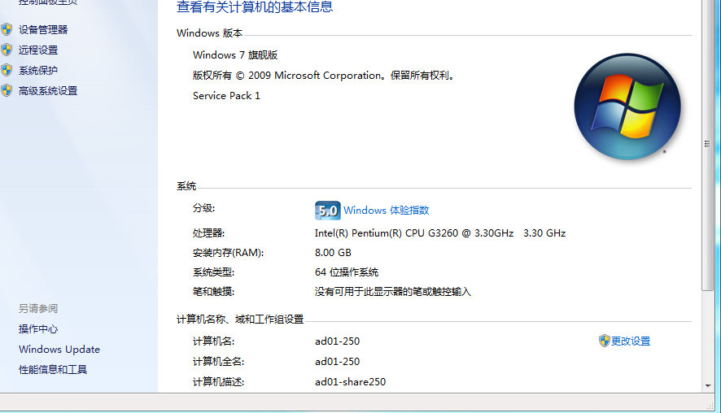

2. 单击安装程序

	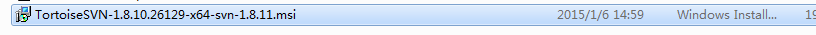

3.	开始安装、

	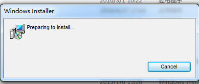

4.	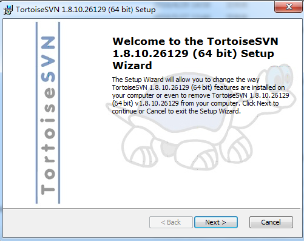

5.  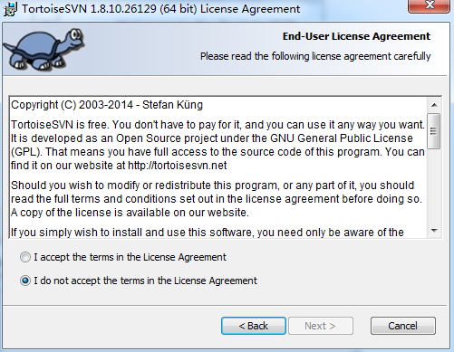

	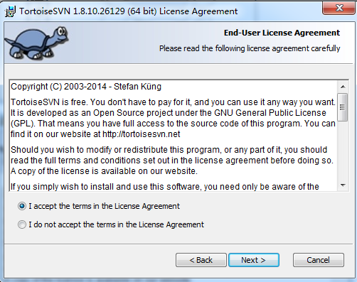

6. 如果图中红色标记部分，没有安装，那么会导致在android studio中 svn开发工具不能使用

	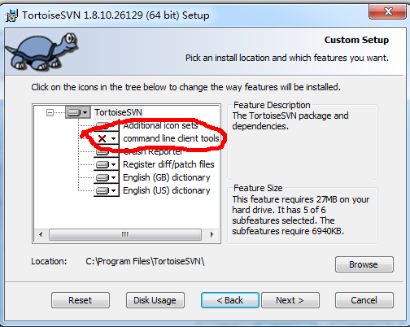
	
7. 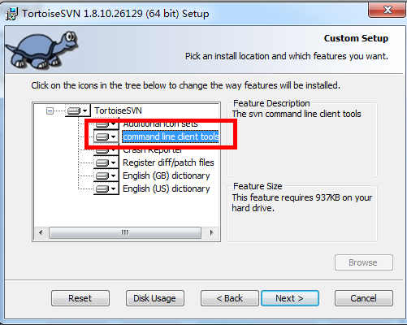

8. 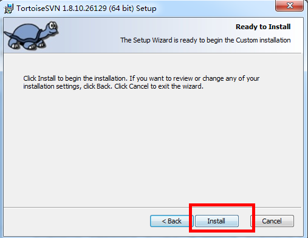

9. ​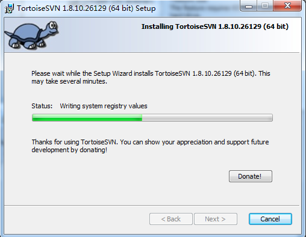

10. 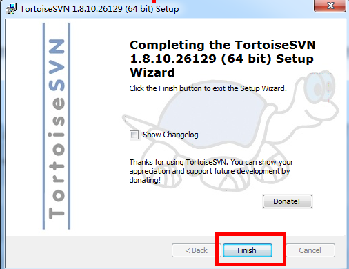

11. 安装成功之后，请在桌面空白处，单击鼠标右键，出现图中情况图标的时候，表明软件安装成功

	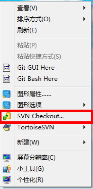
	
12. 然后单击svn checkeckout 在弹出的输入框中，需要输入svn地址测试 以下 

	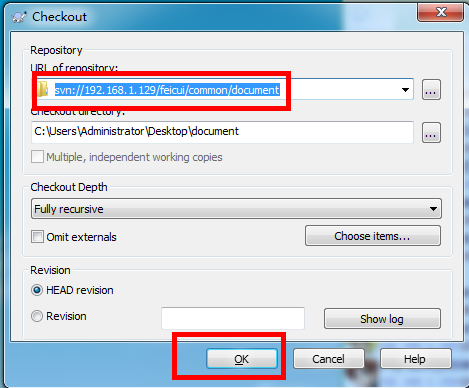
	
	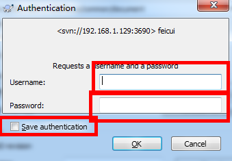
	
	测试地址：svn://192.168.1.129/feicui/common/document
	测试账号: feicui_xxxx 请找负责人索取
	密码：123456

13.	密码验证通过后，会开始从svn下载，下载完成后，即可点击OK，完成svn文件的下载

	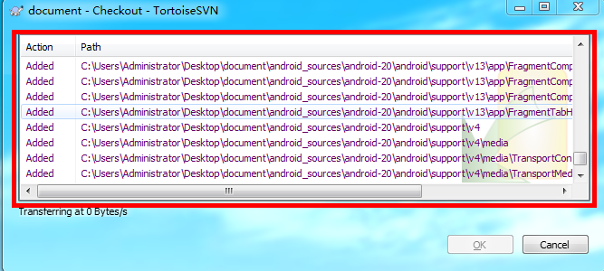

